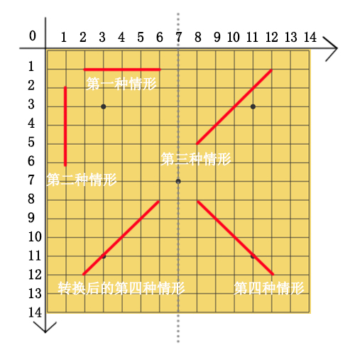

## 五子棋

### UI部分
使用canvas绘制棋盘、棋子
#### 棋盘绘制
```
    //绘制背景色
    fillRect(0, 0, 500, 560);
    //棋盘棋盘线条
    for (let i = 0; i < 15; i++) {
       this.con.moveTo(0, i * 30);
       this.con.lineTo(420, i * 30);
    }
    for (let i = 0; i < 15; i++) {
       this.con.moveTo(i * 30, 0);
       this.con.lineTo(i * 30, 420);
    }
    //棋子，计算出点击位置的x，y坐标，并以此为中心绘制圆
    arc(x * 30, y * 30, 14, 0, 2 * Math.PI, false);
    //黑色棋子渐变色
    let blackPieceColor = this.con.createRadialGradient(x * 30, y * 30, 5, x * 30 + 16, y * 30 + 16, 35);
    blackPieceColor.addColorStop(0, '#0a0a0a');
    blackPieceColor.addColorStop(1, '#666');
    //白色棋子渐变色
    let whitePieceColor = this.con.createRadialGradient(x * 30, y * 30, 5, x * 30 + 16, y * 30 + 16, 35);
    whitePieceColor.addColorStop(0, '#efefef');
    whitePieceColor.addColorStop(1, '#d1d1d1');
```
#### JS部分

### 棋盘点击事件
    计算点击位置的坐标值
    let x = Math.round((e.offsetX - 40) / 30);
    let y = Math.round((e.offsetY - 40) / 30);
### 胜负逻辑判定
将白棋、黑棋所下的五子棋的位置按照如图所示的坐标系分别保存在一个二维数组里，那
么只有四种情况下胜利的，

1. 横着一排连续五个胜利，也就是x一样，y连续加1
```
按照坐标y排序，y一样对比x的值
        排序
        function (arr) {
                    arr.sort(function (a, b) {
                        if (a[0] > b[0]) {
                            return 1
                        }
                        else if (a[0] === b[0] && a[1] > b[1]) {
                            return 1
                        }
                        else {
                            return -1
                        }
                    });
                    return arr
                }
        是否胜利
        function (arr) {
            arr = this._acrossSort(arr);
            for (let i = 0, j = 0; i < arr.length - 1; i++) {
                if (arr[i][1] === arr[i + 1][1] && arr[i][0] + 1 === arr[i + 1][0]) {
                    j++;
                    if (j === 4) {
                        return true
                    }
                }
                else {
                    j = 0;
                }
            }
            return false
        }
```
2. 竖着一排连续五个胜利，也就是y一样，x连续加1
```
按照坐标x排序，x一样对比y的值
        排序
        function (arr) {
            arr.sort(function (a, b) {
                if (a[1] > b[1]) {
                    return 1
                }
                else if (a[1] === b[1] && a[0] > b[0]) {
                    return 1
                }
                else {
                    return -1
                }
            });
            return arr
        }
        是否胜利
        function (arr) {
                    arr = this._acrossSort(arr);
                    //横排胜利
                    for (let i = 0, j = 0; i < arr.length - 1; i++) {
                        if (arr[i][1] === arr[i + 1][1] && arr[i][0] + 1 === arr[i + 1][0]) {
                            j++;
                            if (j === 4) {
                                return true
                            }
                        }
                        else {
                            j = 0;
                        }
                    }
                    return false
         }
```

3. 斜着一排连续五个胜利，也就是x+y的值都一样并且x的值连续加一，y的值连续减一
```
按照x+y的值排序，如果一样，对比x的值
        计算x+y的值
        function (arr) {
            arr = this._deepCopy(arr);
            for (let i = 0; i < arr.length; i++) {
                arr[i].push(arr[i][0] + arr[i][1])
            }
            return this._arrEleSame(arr);

        }
        是否胜利
        function (result) {
                    result = this._deepCopy(result);
                    result.sort(function (a, b) {
                        if (a[2] - b[2] > 0) {
                            return 1
                        }
                        else if (a[2] === b[2] && a[1] - b[1] > 0) {
                            return 1
                        }
                        else{
                            return -1
                        }
                    });
                    //如果相差4个的子元素的x值也相差4并且x+y的值相等就是五子连珠
                    for (let i = 0; i < result.length - 4; i++) {
                        if (result[i][0] + 4 === result[i + 4][0] && result[i][2] === result[i + 4][2]) {
        
                            return true
                        }
                    }
                    return false
         }
```

4. 反着斜排连续五个胜利，把坐标以（7，0）为轴改变坐标点的值，然后同上

```
将x坐标对着x=7的竖线做镜像对换，然后同3
        计算镜像后的x的值，计算x+y 
        function (arr) {
            arr = this._deepCopy(arr);
            for (let i = 0; i < arr.length; i++) {
                arr[i][0] = (14 - arr[i][0]);
                arr[i].push(arr[i][0] + arr[i][1])
            }
            return this._arrEleSame(arr);
        }
```

 